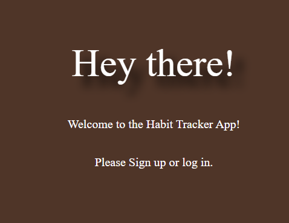

# Habit Tracker App

A full-stack habit tracking application that lets users create, manage, and complete recurring habits while visualizing progress over time. Users can sign up, log in, create habits with frequency and duration goals, mark them complete, and view historical completion logs with a progress bar for each habit.

## Why I Built It

I wanted a focused tool for building consistent routines—something simpler than full productivity suites, but smarter than a static checklist. 

## Live App & Planning

- Deployed App: https://dailyhabitracker-e2247b7e6739.herokuapp.com/
- Planning Docs: https://excalidraw.com/#json=bvW4VPLm1lSG2UbyYViDE,RBNfqC0jcYiC13a_jiue9Q
  - this includes Wireframes, ERD / Data Model:
  - user stories

## Technologies Used

- Runtime: Node.js
- Server: Express.js
- Views: EJS templating
- Database: MongoDB + Mongoose
- Auth & Security: bcrypt, express-session
- Utilities: method-override, dotenv, morgan
- Styling: Custom CSS (responsive, themed)
- Date Logic: Custom helper utilities (frequency-based due checks)
- Template Engine Features: Partials, conditional rendering
- Copilot (AI) for extracurricular items

## Attributions

- Node.js / Express.js documentation
- MongoDB & Mongoose libraries
- bcrypt for password hashing
- Inspiration from common habit/streak tracking UX patterns (no licensed assets used)
(Include any fonts, icons, or external design resources here if applicable.)

## Current Limitations

- No email/password reset
- No API for mobile clients yet
- No streak calculation displayed
- No push or email reminders

## Next Steps (Planned Enhancements)

- Streak tracking and longest streak badge
- Weekly / monthly analytics dashboard (completion rate trends)
- Habit categories & tagging
- Custom reminder scheduling (email / push)
- Calendar heatmap of completions
- REST/JSON API for mobile integration
- Dark/light theme toggle button
- Accessibility audit (focus states, reduced motion option)
- Unit + integration test coverage (Jest / Supertest)
- Role-based multi-user groups or accountability sharing

## Key Logic Highlight

- Progress bar: unique completed days / duration * 100 (capped)
- Frequency due rules: daily vs weekly vs monthly comparison via centralized helpers
- Log system: append-only habitLog array (completed/missed entries)

